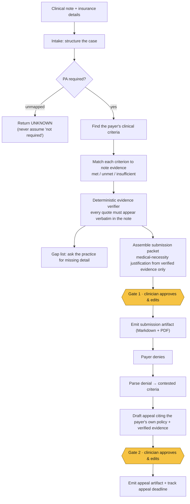

# Attest

**An AI agent that handles the prior-authorization lifecycle for small specialty practices** — from deciding whether a service needs a prior authorization (PA), to assembling a criteria-matched request, to auto-drafting the appeal when a payer denies.

[](LICENSE)
[](STATUS.md)
[](https://agentsforhumans.devpost.com)
[](https://github.com/strands-agents)

> **Project status — early development.** The product design, phase plan, and engineering protocol are complete; the implementation is in progress. Nothing is runnable end to end yet. See [Project status & roadmap](#project-status--roadmap) for exactly where things stand, and [STATUS.md](STATUS.md) for the live board.

---

## Contents

- [The problem](#the-problem)
- [What Attest does](#what-attest-does)
- [Who it's for](#who-its-for)
- [How it works](#how-it-works)
- [Design principles](#design-principles)
- [Tech stack](#tech-stack)
- [Project status & roadmap](#project-status--roadmap)
- [Repository layout](#repository-layout)
- [Getting started](#getting-started)
- [Compliance, safety & scope](#compliance-safety--scope)
- [Hackathon context](#hackathon-context)
- [License](#license)

---

## The problem

Prior authorization is insurer pre-approval required before a clinician can deliver a covered service. It is the largest administrative time-sink in outpatient care, and small/solo specialty practices (behavioral health, physical therapy, occupational/speech therapy, pain, imaging) absorb it directly because they have no dedicated PA staff.

- Practices complete **~39–43 PA requests per physician per week** (AMA 2024/2025 surveys).
- **~13 hours/week** of physician + staff time is consumed by PA.
- **~31% of physicians** report requests are often or always denied — and denials have risen over five years.
- **Appeals work but are under-used** — many practices don't appeal because they expect to lose, and those who do rebuild each appeal from scratch.

Existing PA vendors target large health systems and deep EHR integrations. Solo and small practices are left with manual portals, faxes, and copy-paste appeal letters. The judgment-heavy part — *does this need a PA? does the note satisfy the payer's criteria? how do we rebut this specific denial?* — is exactly what current tooling leaves to a human. That is the gap Attest fills.

## What Attest does

Given a patient's clinical note and insurance details, Attest:

1. **Reads and structures the case** — service requested, diagnosis, requested duration/units, payer, and plan.
2. **Determines whether a prior authorization is required** for that service under that payer/plan, and explains why, pointing to the policy it relied on.
3. **Finds the payer's own clinical criteria** and **checks the note against each one**, marking each as *met*, *unmet*, or *insufficiently supported* — quoting the exact note evidence for each.
4. **Flags gaps** — where a criterion isn't supported, it says so and asks the practice for the missing detail rather than guessing.
5. **Assembles a submission-ready request** — completed request fields, a medical-necessity justification written *only* from approved evidence, and a plain-language checklist of how each criterion is covered.
6. **Pauses for the clinician to approve or edit** every clinical assertion before anything is submitted. *(Gate 1)*
7. **Produces the outbound submission artifact** once approved.
8. **Turns a denial into an appeal** — reads the denial reason, identifies which criteria the payer contests, and drafts an appeal citing the payer's own policy language and the note evidence — again held for human approval. *(Gate 2)*
9. **Tracks each case and its appeal deadline**, and reuses language from prior successful appeals on similar future denials.

**The goal:** cut the human time per PA from ~20–30 minutes to a short review-and-approve step, raise first-pass approval rates by mapping every submission to the payer's stated criteria before it goes out, and make appeals the default rather than the exception.

## Who it's for

- **Primary:** the office manager, front-desk staff, or owner-clinician at a **1–10 provider specialty practice** who personally handles PAs.
- **Secondary:** the treating clinician who must approve the clinical justification.
- **Specialty focus:** one specialty at a time, so the product speaks that specialty's language and payer rules precisely. The flagship demo case is **outpatient behavioral health — TMS (transcranial magnetic stimulation) for treatment-resistant depression**, whose criteria are among the most enumerable of any common PA (age, confirmed severe MDD, failed antidepressant trials at adequate dose and duration, psychotherapy trial, seizure/implant contraindications, baseline PHQ‑9/HAM‑D, FDA-cleared device). Physical therapy ships later as an extensibility pack to prove the engine is specialty-agnostic.

## How it works

The engine runs autonomously between two hard human-approval gates:



Attest is built as a multi-step, tool-using agent system on the **Strands Agents SDK**, with specialist agents (intake, criteria matching, packet assembly, appeal drafting) composed under an orchestrator. Both approval gates are implemented on Strands' first-class human-in-the-loop primitive (`BeforeToolCallEvent.interrupt(...)`), so the gate holds even when the agent is driven headlessly — it is a product requirement, not UI logic.

## Design principles

These are non-negotiable and encoded as tests, not aspirations:

- **The agent assembles and argues; humans decide and submit.** It never makes a coverage or medical-necessity decision on its own. Two hard gates — before submission and before an appeal is sent — require a clinician to review and approve every clinical assertion.
- **Evidence-traceable by design.** No clinical claim enters any document unless a **deterministic verifier** confirms the quote appears verbatim in the source note (under whitespace normalization). A semantically correct paraphrase is *rejected on purpose* — paraphrase is the hallucination failure mode being defended against. Unverifiable spans downgrade their criterion to *insufficient* and are logged, never silently dropped.
- **Absence of a policy is not evidence that no PA is needed.** An unmapped service returns `UNKNOWN`, never "not required" — telling a practice "no PA needed" because a policy wasn't found is the worst possible failure.
- **The engine is specialty-agnostic; specialties are data.** Policy packs and extraction schemas are data files; no specialty knowledge is hardcoded. Adding a specialty costs a pack, not a rewrite.
- **Synthetic data only.** All notes and denial letters are synthetic and banner-marked; ground-truth expected outcomes are committed *before* any matching code exists, which is what makes every later step objectively verifiable. Live payer-portal / EHR integration and real-PHI handling are explicitly post-hackathon.

## Tech stack

| Area | Choice |
|---|---|
| Language | Python |
| Agent framework | `strands-agents`, `strands-agents-tools` |
| Model | Claude on **Amazon Bedrock** (exact model id confirmed against `bedrock list-foundation-models` before it is pinned) |
| Structured output | Strands structured output → Pydantic models (typed verdicts, never parsed from prose) |
| Human-in-the-loop | `BeforeToolCallEvent.interrupt(...)` |
| Deployment | **Amazon Bedrock AgentCore Runtime** (`BedrockAgentCoreApp` + `@app.entrypoint`) |
| UI | **Streamlit**, hosted on Streamlit Community Cloud for a free, public, judge-testable link |
| Validation / data | `pydantic`, `pyyaml` |
| Testing | `pytest`, with every build step gated behind a cumulative test marker |

## Project status & roadmap

Work is organized into small, individually verifiable steps. A step is **done only when its gate (`./scripts/verify.sh <STEP_ID>`) exits zero** — running that step's tests plus every prior step's, so a later step cannot silently break an earlier one. The authoritative Definitions of Done live in [PLAN.md](PLAN.md); live progress lives in [STATUS.md](STATUS.md).

| Phase | Focus | State |
|---|---|---|
| **P0** | Foundation, AWS/Bedrock access, engineering protocol, repo skeleton | 🟡 in progress |
| **P1** | Domain models, policy-pack format, real public TMS policies, synthetic corpus + ground truth | ⬜ planned |
| **P2** | Intake (note → structured case) and PA-required determination | ⬜ planned |
| **P3** ▲ | Criteria engine — per-criterion evidence matching + the deterministic verifier *(the core)* | ⬜ planned |
| **P4** ▲ | Packet assembly & Gate 1 (approval before submission) | ⬜ planned |
| **P5** ▲ | Denial → appeal loop & Gate 2 (approval before appeal) | ⬜ planned |
| **P6** ▲ | Case tracking, precedent reuse, Streamlit UI, public deploy | ⬜ planned |
| — | **Submittable product complete through here** | |
| **P7** | Multi-agent orchestration depth + AgentCore deployment | ⬜ upside |
| **P8** | Submission deliverables (README, architecture diagram, metrics, demo video, Devpost) | ⬜ planned |

▲ = required for a viable submission. As of the latest planning session, the foundation phase (P0) is underway — the product spec, phase plan, decision log, and license are in place, and the repository skeleton is being built out.

## Repository layout

The repository currently holds the product definition and the engineering protocol that lets two contributors hand work off cleanly across sessions and machines:

| File | Purpose |
|---|---|
| [`Attest-PRODUCT.md`](Attest-PRODUCT.md) | The product specification — what it is, what it must achieve, and the rules it must satisfy. No architecture or build planning. |
| [`PLAN.md`](PLAN.md) | The contract: every phase, step, and machine-checkable Definition of Done. Changes rarely. |
| [`STATUS.md`](STATUS.md) | The live status board — one row per step; the single source of truth for progress. |
| [`DECISIONS.md`](DECISIONS.md) | Append-only decision log — every non-obvious choice and the reasoning behind it. |
| [`LICENSE`](LICENSE) | Apache License 2.0. |

The planned source layout (introduced as the phases land) is `src/attest/` for the agents, criteria engine, verifier, packet/appeal modules and case store; `data/synthetic/` for notes, denials, and committed ground truth; `scripts/verify.sh` for the step gate; and `app.py` for the Streamlit UI.

### Working protocol

This is a two-person, sequential build (one contributor works until their usage limit, then the other resumes on another machine). Because context is lost at every handoff, the three committed files above — plan, status, decisions — *are* the shared memory. A session starting cold reads `STATUS.md` → `DECISIONS.md` → `PLAN.md`, runs the gate for the last step marked done to verify (not trust) the previous session's claim, then continues.

## Getting started

> ⚠️ **Not yet runnable.** The commands below describe the intended developer setup and will work once the core phases (P0–P6) land. Track readiness in [STATUS.md](STATUS.md).

Planned setup:

```bash
git clone https://github.com/ojassug/Attest.git
cd Attest
pip install -e .

# run the criteria engine against a synthetic case (planned)
python -m attest.demo --case clean

# launch the reviewer UI (planned)
streamlit run app.py
```

Running the agent will require AWS credentials with Amazon Bedrock model access in the configured region. Exact setup — region, model id, and credentials — will be documented in `docs/aws-setup.md` as part of the foundation phase.

## Compliance, safety & scope

- **Privacy-first.** The product is designed around encryption in transit and at rest, least-privilege access, and a complete audit trail of every agent action and every human approval.
- **Synthetic data only for the hackathon.** No real patient data is used in the build or the demo video. Live payer-portal / EHR integration and real-PHI handling are explicitly post-hackathon, gated on the appropriate agreements.
- **Honest scope.** Attest is an assistant that produces submission-ready and appeal-ready documents *for human approval* — not an autonomous authority over care decisions.

**Explicitly out of scope:** it is not an EHR, practice-management, or billing/clearinghouse system; not a coverage or medical decision-maker; not a general healthcare chatbot; and it does no live payer/EHR integration or real-PHI handling in the hackathon build.

## Hackathon context

Attest is being built for the **AWS "Agents for Humans" hackathon** (sponsored by Amazon Web Services, administered by Devpost), in the **Professional Agents** track. The submission window runs **Aug 10 – Sep 14, 2026**. The hackathon requires a newly built agent on the **Strands Agents SDK** that does real work end to end; deploying with **Amazon Bedrock AgentCore** is optional but strengthens the technical-implementation score. Judging weighs Technical Implementation, Design, Potential Impact, Creativity & Originality, and Presentation equally.

## License

Licensed under the [Apache License 2.0](LICENSE).

---

*"Attest" is a working name and may change.*
